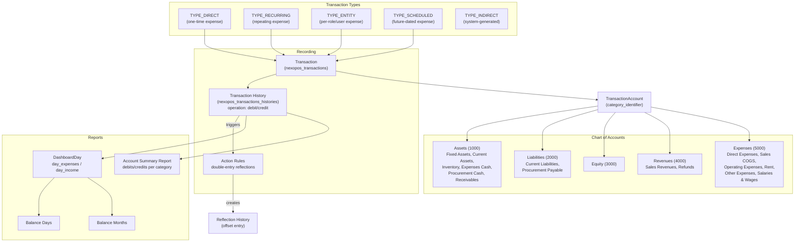

# Accounting / Transactions / Expenses System — Codebase Report

## 1. Transaction Table Schema (`nexopos_transactions`)

**Migration:** [`database/migrations/create/2020_06_20_000000_create_expenses_table.php`](database/migrations/create/2020_06_20_000000_create_expenses_table.php)

| Column             | Type            | Notes                                                                                                                                                                          |
| ------------------ | --------------- | ------------------------------------------------------------------------------------------------------------------------------------------------------------------------------ |
| `id`               | `bigIncrements` | PK                                                                                                                                                                             |
| `name`             | `string`        | Transaction name                                                                                                                                                               |
| `account_id`       | `integer`       | FK → `nexopos_transactions_accounts.id`                                                                                                                                        |
| `description`      | `text`          | Nullable                                                                                                                                                                       |
| `media_id`         | `integer`       | Default 0                                                                                                                                                                      |
| `value`            | `float(18,5)`   | Default 0                                                                                                                                                                      |
| `recurring`        | `boolean`       | Default false                                                                                                                                                                  |
| `type`             | `string`        | Nullable. Values: `direct`, `recurring`, `salary`, `scheduled`, `entity`, `indirect`                                                                                           |
| `active`           | `boolean`       | Default false                                                                                                                                                                  |
| `group_id`         | `integer`       | Nullable. FK → `roles.id` (for entity-type transactions per role/user group)                                                                                                   |
| `occurrence`       | `string`        | Nullable. e.g. `month_starts`, `month_ends`, `month_mid`, `on_specific_day`, `x_after_month_starts`, `x_before_month_ends`, `every_x_days`, `every_x_hours`, `every_x_minutes` |
| `occurrence_value` | `string`        | Nullable. e.g. "1", "2", "3"                                                                                                                                                   |
| `scheduled_date`   | `datetime`      | Nullable                                                                                                                                                                       |
| `author_id`        | `integer`       | FK → `users.id`                                                                                                                                                                |
| `uuid`             | `string`        | Nullable                                                                                                                                                                       |
| `created_at`       | `timestamp`     |                                                                                                                                                                                |
| `updated_at`       | `timestamp`     |                                                                                                                                                                                |

**Model constants for `type`:**

- `TYPE_SCHEDULED = 'ns.scheduled-transaction'`
- `TYPE_RECURRING = 'ns.recurring-transaction'`
- `TYPE_ENTITY = 'ns.entity-transaction'`
- `TYPE_DIRECT = 'ns.direct-transaction'`
- `TYPE_INDIRECT = 'ns.indirect-transaction'`

**Relationships on Transaction model:**

- `belongsTo(TransactionAccount, 'account_id')` — always eager-loaded via global scope
- `hasMany(TransactionHistory, 'transaction_id')`
- `belongsTo(User, 'author_id')`

---

## 2. Transaction Account (Chart of Accounts) Schema (`nexopos_transactions_accounts`)

**Migration:** [`database/migrations/create/2020_06_20_000000_create_expenses_categories_table.php`](database/migrations/create/2020_06_20_000000_create_expenses_categories_table.php)

| Column                | Type            | Notes                                                                                |
| --------------------- | --------------- | ------------------------------------------------------------------------------------ |
| `id`                  | `bigIncrements` | PK                                                                                   |
| `name`                | `string`        | Account name (e.g. "Salaries And Wages")                                             |
| `account`             | `string`        | Default 0. Auto-generated account number (e.g. `5000-1-expenses-salaries-and-wages`) |
| `sub_category_id`     | `integer`       | Nullable. FK self-referencing for parent-child hierarchy                             |
| `category_identifier` | `string`        | Nullable. One of: `assets`, `liabilities`, `equity`, `revenues`, `expenses`          |
| `description`         | `text`          | Nullable                                                                             |
| `author_id`           | `integer`       |                                                                                      |
| `uuid`                | `string`        | Nullable                                                                             |
| `created_at`          | `timestamp`     |                                                                                      |
| `updated_at`          | `timestamp`     |                                                                                      |

**Relationships on TransactionAccount model:**

- `hasMany(Transaction, 'account_id')`
- `hasMany(TransactionHistory, 'transaction_account_id')`

---

## 3. Transaction History Schema (`nexopos_transactions_histories`)

**Migration:** [`database/migrations/create/2020_10_29_150642_create_nexopos_expenses_history_table.php`](database/migrations/create/2020_10_29_150642_create_nexopos_expenses_history_table.php)

| Column                        | Type          | Notes                                                             |
| ----------------------------- | ------------- | ----------------------------------------------------------------- |
| `id`                          | `id`          | PK                                                                |
| `transaction_id`              | `integer`     | Nullable. FK → `nexopos_transactions.id`                          |
| `operation`                   | `string`      | `debit` or `credit`                                               |
| `is_reflection`               | `boolean`     | Default false. Marks double-entry offset records                  |
| `reflection_source_id`        | `integer`     | Nullable. Links to the source history record for reflection pairs |
| `transaction_account_id`      | `integer`     | Nullable. FK → `nexopos_transactions_accounts.id`                 |
| `procurement_id`              | `integer`     | Nullable                                                          |
| `order_refund_id`             | `integer`     | Nullable                                                          |
| `order_payment_id`            | `integer`     | Nullable                                                          |
| `order_refund_product_id`     | `integer`     | Nullable                                                          |
| `order_id`                    | `integer`     | Nullable                                                          |
| `order_product_id`            | `integer`     | Nullable                                                          |
| `register_history_id`         | `integer`     | Nullable                                                          |
| `customer_account_history_id` | `integer`     | Nullable                                                          |
| `name`                        | `string`      | Display name for this history record                              |
| `type`                        | `string`      | Nullable. Mirrors transaction type                                |
| `status`                      | `string`      | Default 'pending'. Values: `active`, `pending`, `deleting`        |
| `value`                       | `float(18,5)` | Default 0                                                         |
| `trigger_date`                | `datetime`    | Nullable                                                          |
| `rule_id`                     | `integer`     | Nullable. FK → `nexopos_transactions_actions_rules.id`            |
| `author_id`                   | `integer`     |                                                                   |
| `created_at`                  | `timestamp`   |                                                                   |
| `updated_at`                  | `timestamp`   |                                                                   |

**Status constants:**

- `STATUS_ACTIVE = 'active'`
- `STATUS_DELETING = 'deleting'`
- `STATUS_PENDING = 'pending'`

**Operation constants:**

- `OPERATION_DEBIT = 'debit'`
- `OPERATION_CREDIT = 'credit'`

---

## 4. Chart of Accounts Structure (Accounting Config)

Defined in [`app/Providers/AppServiceProvider.php:358-391`](app/Providers/AppServiceProvider.php:358):

```php
'accounting.accounts' => [
    'assets'      => [ 'increase' => 'debit',  'decrease' => 'credit', 'label' => 'Assets',      'account' => 1000 ],
    'liabilities' => [ 'increase' => 'credit', 'decrease' => 'debit',  'label' => 'Liabilities', 'account' => 2000 ],
    'equity'      => [ 'increase' => 'credit', 'decrease' => 'debit',  'label' => 'Equity',      'account' => 3000 ],
    'revenues'    => [ 'increase' => 'credit', 'decrease' => 'debit',  'label' => 'Revenues',    'account' => 4000 ],
    'expenses'    => [ 'increase' => 'debit',  'decrease' => 'credit', 'label' => 'Expenses',    'account' => 5000 ],
];
```

---

## 5. Default Accounts Created by `createAllSubAccounts()`

Found in [`app/Services/TransactionService.php:1297-1519`](app/Services/TransactionService.php:1297):

### Top-Level Category Accounts:

| Account Name        | `category_identifier` | Account # Prefix |
| ------------------- | --------------------- | ---------------- |
| Fixed Assets        | assets                | 1000             |
| Current Assets      | assets                | 1000             |
| Inventory Account   | assets                | 1000             |
| Current Liabilities | liabilities           | 2000             |
| Sales Revenues      | revenues              | 4000             |
| Direct Expenses     | expenses              | 5000             |

### Sub-Accounts (with `sub_category_id`):

| Account Name           | Parent              | `category_identifier` |
| ---------------------- | ------------------- | --------------------- |
| Expenses Cash          | Current Assets      | assets                |
| Procurement Cash       | Current Assets      | assets                |
| Procurement Payable    | Current Liabilities | liabilities           |
| Receivables            | Current Assets      | assets                |
| Sales                  | Current Assets      | assets                |
| Refunds                | Sales Revenues      | revenues              |
| Sales COGS             | Direct Expenses     | expenses              |
| **Operating Expenses** | Direct Expenses     | expenses              |
| **Rent Expenses**      | Direct Expenses     | expenses              |
| **Other Expenses**     | Direct Expenses     | expenses              |
| **Salaries And Wages** | Direct Expenses     | expenses              |

---

## 6. How Expenses/Transactions Are Recorded

### Create Flow:

1. **API**: `POST /api/transactions` → [`TransactionController::post()`](routes/api/transactions.php:14)
2. **Service**: [`TransactionService::create($fields)`](app/Services/TransactionService.php:158) — saves all fields to a new `Transaction` model, sets `author_id`, fires `TransactionAfterCreatedEvent`
3. The event handler may trigger history recording depending on configuration

### Trigger Flow (executing a transaction):

1. **API**: `GET /api/transactions/trigger/{id}` → [`TransactionController::triggerTransaction()`](routes/api/transactions.php:6)
2. **Service**: [`TransactionService::triggerTransaction(Transaction $transaction)`](app/Services/TransactionService.php:451)
    - Validates type is `direct`, `entity`, `scheduled`, or `indirect`
    - Calls `recordTransactionHistory($transaction)`
    - Sets `active = false` to prevent re-triggering

### Record History Flow:

[`TransactionService::recordTransactionHistory($transaction)`](app/Services/TransactionService.php:555):

**If `group_id` is set (entity-type / multi-user):**

- Finds the Role by `group_id`
- Creates one `TransactionHistory` per user in that role
- Replaces `{user}` placeholder in the name with the user's username
- Operation is hardcoded to `'debit'`
- Status is `STATUS_ACTIVE`

**If no `group_id` (single / direct):**

- Calls `iniTransactionHistory($transaction)` which:
    - Looks up the `category_identifier` from the transaction's account
    - Gets the main account config (e.g., `expenses` → `'increase' => 'debit'`)
    - Creates a `TransactionHistory` record with `operation` from the config's `increase` value
    - Status is `STATUS_ACTIVE`
    - Sets `trigger_date` to now
    - Copies reference IDs for procurement, order, refund, register, customer account

### Entity-Type (Per-Role) Transactions:

When `group_id` is set, the transaction creates a `TransactionHistory` per user belonging to that role. This is the closest existing concept to "payroll" — each user in a role gets a history record. The name can use the `{user}` placeholder.

---

## 7. Transaction Action Rules (Double-Entry)

Defined in [`database/migrations/create/2024_09_02_023528_create_accounting_table_actions.php`](database/migrations/create/2024_09_02_023528_create_accounting_table_actions.php):

**Table:** `nexopos_transactions_actions_rules`

| Column              | Type                                                             |
| ------------------- | ---------------------------------------------------------------- |
| `id`                | PK                                                               |
| `on`                | string — event trigger (e.g. `procurement_unpaid`, `order_paid`) |
| `action`            | enum: `increase`, `decrease`                                     |
| `account_id`        | integer — the main account to affect                             |
| `do`                | enum: `increase`, `decrease` — what to do to the offset account  |
| `offset_account_id` | integer — the counter account for double-entry                   |
| `locked`            | boolean, default false                                           |

**Rules created in `createAllSubAccounts()`:**

| Rule Event                        | Main Account                                      | Offset Account                                   |
| --------------------------------- | ------------------------------------------------- | ------------------------------------------------ |
| `procurement_unpaid`              | Inventory (increase)                              | Procurement Payable (increase)                   |
| `procurement_paid`                | Inventory (increase) + Expenses Cash (increase)   | Procurement Cash (decrease)                      |
| `procurement_from_unpaid_to_paid` | Procurement Payable (decrease)                    | Procurement Cash (decrease)                      |
| `order_unpaid`                    | Receivables (increase) + Expenses Cash (increase) | Sales Revenues (increase) + Inventory (decrease) |
| `order_from_unpaid_to_paid`       | Sales (decrease)                                  | Receivables (increase)                           |
| `order_paid`                      | Sales (increase)                                  | Receivables (decrease)                           |
| `order_refunded`                  | Sales Revenues (decrease)                         | Sales (decrease)                                 |
| `order_cogs`                      | Sales COGS (increase)                             | Inventory (decrease)                             |
| `order_paid_voided`               | Sales (increase)                                  | Sales (decrease)                                 |
| `order_unpaid_voided`             | Sales Revenues (decrease)                         | Receivables (decrease)                           |

---

## 8. Payroll / Salary Concept

### Existing "Salary" in the Codebase:

1. **`Salaries And Wages` account** — created by default in [`createAllSubAccounts()`](app/Services/TransactionService.php:1405):

    ```php
    $salariesAndWages = $this->createAccount([
        'name' => 'Salaries And Wages',
        'category_identifier' => 'expenses',
        'sub_category_id' => $directExpenseResponse['data']['account']->id,
    ]);
    ```

    This is a sub-account under **Direct Expenses** (category `expenses`, account #5000 range). **No transaction action rules are created for this account** — it's a passive expense category that requires manual transaction creation.

2. **Original migration comment** in [`2020_06_20_000000_create_expenses_table.php:28`](database/migrations/create/2020_06_20_000000_create_expenses_table.php:28):

    ```php
    $table->string('type')->nullable(); // direct, recurring, salary
    ```

    Indicates `salary` was an originally intended transaction type.

3. **Entity-type transactions** (`group_id` set, `TYPE_ENTITY`) — these create per-user history records. The `TransactionCrud` uses `EntityTransactionFields` with icon `images/salary.png`, suggesting entity-type transactions are the intended mechanism for salary/commission payouts.

### There is NO dedicated "payroll" module or system:

- No payroll-specific tables, models, or controllers
- No attendance-to-payroll integration
- No salary computation logic
- No deductions, allowances, or tax calculation
- No payslip generation

The closest mechanism is the **entity-type transaction** where a `group_id` (Role) is assigned, and when triggered, it creates one `TransactionHistory` per user in that role with a `{user}` name placeholder.

---

## 9. How Accounting Reports Aggregate Expenses

### `ReportService::getAccountSummaryReport()` ([line 1313](app/Services/ReportService.php:1313)):

- Iterates over all 5 account categories from config (`assets`, `liabilities`, `equity`, `revenues`, `expenses`)
- For each category, finds all `TransactionAccount` records with matching `category_identifier`
- Loads their `histories` (TransactionHistory) filtered by date range
- Summarizes `debits` and `credits` per account and per category
- Calculates `profit = total_credits - total_debits`

### `ReportService::increaseDailyExpenses()` ([line 352](app/Services/ReportService.php:352)):

- Called when a TransactionHistory is created
- If `operation === 'debit'`: adds value to `DashboardDay.day_expenses` and `DashboardDay.total_expenses`
- If `operation === 'credit'`: adds value to `DashboardDay.day_income` and `DashboardDay.total_income`

### Balance Tracking Tables:

- [`nexopos_transactions_balance_days`](database/migrations/create/2024_04_29_214452_create_transaction_balance_days_table.php): `opening_balance`, `income`, `expense`, `closing_balance`, `date`
- [`nexopos_transactions_balance_months`](database/migrations/create/2024_04_29_214459_create_transaction_balance_months_table.php): same structure but per month

---

## 10. Key TransactionService Methods Relevant to Recording Payouts

| Method                                                                                                    | Lines     | Purpose                                                                                                  |
| --------------------------------------------------------------------------------------------------------- | --------- | -------------------------------------------------------------------------------------------------------- |
| [`create($fields)`](app/Services/TransactionService.php:158)                                              | 158-176   | Creates a new Transaction record from field array                                                        |
| [`edit($id, $fields)`](app/Services/TransactionService.php:178)                                           | 178-200   | Updates an existing Transaction                                                                          |
| [`triggerTransaction($transaction)`](app/Services/TransactionService.php:451)                             | 451-477   | Executes a transaction (creates history, deactivates)                                                    |
| [`recordTransactionHistory($transaction)`](app/Services/TransactionService.php:555)                       | 555-587   | Creates TransactionHistory record(s); handles `group_id` for per-role/user                               |
| [`iniTransactionHistory($transaction)`](app/Services/TransactionService.php:517)                          | 517-544   | Initializes a TransactionHistory from a Transaction (sets operation based on category_identifier config) |
| [`prepareTransactionHistoryRecord($transaction)`](app/Services/TransactionService.php:497)                | 497-508   | Creates a pending (scheduled) history record                                                             |
| [`handleRecurringTransactions($date)`](app/Services/TransactionService.php:596)                           | 596-683   | Processes all recurring transactions due on a given date                                                 |
| [`hadTransactionHistory($date, $transaction)`](app/Services/TransactionService.php:685)                   | 685-698   | Checks if a transaction already has history for a given date                                             |
| [`createAccount($fields)`](app/Services/TransactionService.php:350)                                       | 350-387   | Creates a new TransactionAccount (expense category)                                                      |
| [`deleteTransaction($transaction)`](app/Services/TransactionService.php:230)                              | 230-243   | Deletes a transaction and its history                                                                    |
| [`getAccountTransactions($id)`](app/Services/TransactionService.php:485)                                  | 485-490   | Gets all transactions for an account                                                                     |
| [`reflectTransactionFromRule($history, $rule)`](app/Services/TransactionService.php:58)                   | 58-132    | Creates double-entry reflection records based on action rules                                            |
| [`getTransactionAccountFromCategory($identifier, $exclude_id)`](app/Services/TransactionService.php:1574) | 1574-1585 | Gets accounts by category identifier for dropdowns                                                       |
| [`getConfigurations($transaction)`](app/Services/TransactionService.php:1129)                             | 1129-1221 | Returns the form configuration for a transaction type                                                    |
| [`recomputeTransactions($fromDate, $toDate)`](app/Services/ReportService.php:1083)                        | —         | Rebuilds balance days/months from transaction histories                                                  |

---

## 11. CRUD Files

| CRUD                                                              | Path                                   | Model                |
| ----------------------------------------------------------------- | -------------------------------------- | -------------------- |
| [`TransactionCrud`](app/Crud/TransactionCrud.php)                 | `app/Crud/TransactionCrud.php`         | `Transaction`        |
| [`TransactionAccountCrud`](app/Crud/TransactionAccountCrud.php)   | `app/Crud/TransactionAccountCrud.php`  | `TransactionAccount` |
| [`TransactionsHistoryCrud`](app/Crud/TransactionsHistoryCrud.php) | `app/Crud/TransactionsHistoryCrud.php` | `TransactionHistory` |

---

## Summary Diagram


